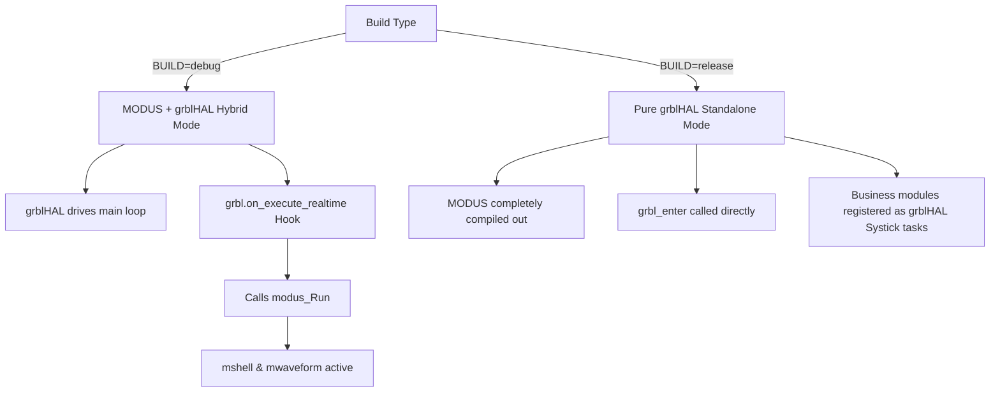

# Firmware Framework Architecture Design: grblHAL & MODUS Hybrid Integration

This document outlines the firmware framework architecture for the CNC control project. It establishes a **bimodal build configuration** that leverages the MODUS framework for development/debugging, and strips it entirely for production/release builds to optimize real-time CNC performance.

---

## 1. Architectural Overview & Paradigm

For a dedicated CNC control project, **grblHAL must be the sole system master in production**. Forcing grblHAL's blocking main loop into MODUS's cooperative stackless protothreads is a mismatch of paradigms. 

However, to retain MODUS's rich debugging components (`mshell`, `mwaveform`, `MLOG`), the system implements a **bimodal architecture**:



### Build Modes Summary

| Feature | Debug Mode (`BUILD=debug`) | Release Mode (`BUILD=release`) |
| :--- | :--- | :--- |
| **Primary Driver** | grblHAL (`protocol_main_loop`) | grblHAL (`protocol_main_loop`) |
| **MODUS Framework** | **Enabled** (via hook in `on_execute_realtime`) | **Disabled** (completely compiled out) |
| **Debugging Tools** | Active (`mshell`, `mwaveform`, `MLOG`) | Inactive (0 bytes overhead) |
| **Business Modules** | Scheduled by `modus_Run` | Scheduled by grblHAL `task_add_systick` |
| **Jitter / Performance** | Acceptable for testing | Maximum performance (hard real-time) |

---

## 2. The Core Problem: Stackless Coroutines vs. Blocking Loops

MODUS's cooperative scheduler uses `perf_counter` protothreads (`PERFC_PT_BEGIN` / `PERFC_PT_END`), which are **stackless coroutines**. 
1. A stackless coroutine yields by storing its state in a local variable and executing a `return` statement.
2. If it calls a nested function like grblHAL's `protocol_main_loop()` (which contains its own infinite blocking `while(true)` loop), any yield within the main loop cannot bubble up because the C compiler does not preserve registers/stack pointers across nested function boundaries.
3. Therefore, grblHAL cannot be directly nested inside a standard MODUS protothread.

---

## 3. Detailed Implementation Plan

### 3.1 `Makefile` Configuration (Compile-Time Cut Off)

We introduce a `MODUS_ENABLE` variable in the `makefile` that gates MODUS compilation:

```makefile
# Default state: MODUS is enabled for development
MODUS_ENABLE ?= 1

# Production Release Mode Configuration
ifeq ($(BUILD),release)
    OPT = -Os
    MODUS_ENABLE = 0
    MSHELL_ENABLE    = 0
    MWAVEFORM_ENABLE = 0
    MSTORAGE_ENABLE  = 0
    MBLINFO_ENABLE   = 0
    MODUS_USE_LOG    = 0
endif

# Conditionally compile MODUS based on configuration
ifeq ($(MODUS_ENABLE),1)
    include $(MODUS_ROOT)/modus.mk
    C_SOURCES += $(MODUS_SRCS) $(CLASS_SOURCES)
    C_INCLUDES += $(MODUS_INCLUDES)
    CFLAGS += $(MODUS_CFLAGS)
    C_DEFS += -DMODUS_ENABLE=1
else
    C_DEFS += -DMODUS_ENABLE=0
endif
```

### 3.2 Boot Entry Configuration (`src/main.c`)

Modify the `main()` function to bypass MODUS initialization in production:

```c
int main(void)
{
    peripheral_Init();
    perfc_init(true);

#if MODUS_ENABLE
    /* === Debug Mode: Guided by MODUS === */
    #if MSHELL_ENABLE || !defined(__NO_USE_LOG__)
        debug_transport_init();
    #endif
    modus_Init(&s_tModus);

    while (1) {
        modus_Run();
    }
#else
    /* === Release Mode: Direct grblHAL Handover === */
    extern int grbl_enter(void);
    grbl_enter(); // Enters grblHAL main loop and never returns
#endif

    return 0;
}
```

### 3.3 Hybrid Hooks & Re-entrancy Guard (`class/grblhal.c`)

In **Debug Mode**, `modus_Run()` must be triggered from within grblHAL's idle loop. We chain grblHAL's `on_execute_realtime` hook and add a re-entrancy guard to prevent recursive re-entry of `grblhal_Run()` when `modus_Run()` polls the object list:

```c
#if GRBLHAL_ENABLE

#include "grblhal_driver.h"
#include "grbllib.h"
#include "protocol.h"
#include "system.h"

#if MODUS_ENABLE
#include "modus.h"
static on_execute_realtime_ptr s_fnPrevExecuteRealtime = NULL;
static bool s_bGrblhalRunning = false;

// Chained realtime callback
static void grblhal_on_execute_realtime(sys_state_t state)
{
    if (s_fnPrevExecuteRealtime) {
        s_fnPrevExecuteRealtime(state);
    }
    
    // Drive other MODUS classes (e.g. mshell, mwaveform, template_class)
    modus_Run();
}
#endif

int grblhal_Init(uintptr_t wObjectAddr, uintptr_t wObjectCfgAddr)
{
    // ... [Original Initialization] ...

    grbl_enter();

#if MODUS_ENABLE
    // Hook grblHAL realtime execution to drive MODUS in Debug Mode
    s_fnPrevExecuteRealtime = grbl.on_execute_realtime;
    grbl.on_execute_realtime = grblhal_on_execute_realtime;
#endif

    return mbase_Init(ptThis->ptBase, &s_tGrblhalBaseCfg);
}

static int grblhal_Run(uintptr_t wObjectAddr)
{
#if MODUS_ENABLE
    // Re-entrancy guard: prevents infinite recursion during modus_Run
    if (s_bGrblhalRunning) {
        return MODUS_SUCCESS;
    }
    s_bGrblhalRunning = true;
#endif

    // Execute standard grblHAL loop
    protocol_execute_realtime();
    protocol_main_loop();

#if MODUS_ENABLE
    s_bGrblhalRunning = false;
#endif
    return MODUS_SUCCESS;
}
#endif
```

---

## 4. Writing Business Logic as Portable Modules (Integrating perf_counter)

Since `perf_counter` is compiled unconditionally (`PERIF_LIB_SOURCES`) in both Debug and Release modes, **you can freely use `perf_counter` features (like `PERFC_PT` protothreads and `perfc_is_time_out_ms` timers) in your grblHAL plugins and stubs.** 

To ensure business modules (sensors, tool changers, safety logic) run in both build modes without code duplication, write them as **independent polling modules** with separate initialization and loop functions using `perf_counter.h`:

```c
// my_custom_logic.c
#include <stdint.h>
#include <stdbool.h>
#include "perf_counter.h"

static uint8_t  s_chPtState = 0;
static uint32_t s_wTimer = 0;

// Core business logic (must be non-blocking)
void my_custom_logic_poll(void *data)
{
    (void)data;
    
    // Using perf_counter's stackless protothreads (PT)
    PERFC_PT_BEGIN(s_chPtState)
    
    // Step 1: Initialize timer (e.g., non-blocking 500ms delay)
    perfc_is_time_out_ms(500, &s_wTimer);
    
    // Step 2: Yield until timer expires
    PERFC_PT_WAIT_UNTIL(perfc_is_time_out_ms(500, &s_wTimer));
    
    // Step 3: Run custom logic after 500ms...
    // [Do some business work here]
    
    PERFC_PT_END()
}
```

### 4.1 Debug Integration (MODUS wrapper)
In `class/template_class.c` (active only when `MODUS_ENABLE == 1`), simply call the logic inside the class run handler:

```c
static int template_class_Run(uintptr_t wObjectAddr)
{
    // Run under MODUS coroutine
    PERFC_PT_BEGIN(this.chState)
    
    while (1) {
        my_custom_logic_poll(NULL);
        PERFC_PT_YIELD();
    }
    
    PERFC_PT_END()
    return MODUS_SUCCESS;
}
```

### 4.2 Release Integration (Pure grblHAL plugin)
In `grblhal_stubs.c` or your custom target driver file (active when `MODUS_ENABLE == 0`), register the module directly as a grblHAL Systick task:

```c
#include "task.h"

extern void my_custom_logic_poll(void *data);

bool grblhal_driver_setup(settings_t *settings)
{
    // ... [Driver setup] ...

#if !MODUS_ENABLE
    // Direct registration in grblHAL system loop (polled every 1ms)
    task_add_systick(my_custom_logic_poll, NULL);
#endif

    return true;
}
```

---

## 5. Risk Assessment & Safety Guidelines

1. **Strict Non-blocking Rule**: Any custom logic called in `my_custom_logic_poll()` **must not** contain blocking loops (`while(busy)`, `delay_ms()`). A blocking call inside grblHAL's loop will immediately lead to stepper pulse jitter, step loss, or limit switch detection delays.
2. **Cooperative Delays**: For time delays, always use the **non-blocking** `PERFC_PT_WAIT_UNTIL(perfc_is_time_out_ms(...))` approach shown in Section 4. This yields the CPU back to the grblHAL motion control engine immediately on every check, ensuring no jitter.
3. **Channel Separation**: To keep G-code streaming free from jitter, use the main physical UART (e.g., USART1) exclusively for grblHAL control, and run MODUS `mshell`/`mwaveform` over Segger RTT or a separate debug UART (e.g., USART2).
4. **RAM Stack Reservation**: Because Debug mode runs `modus_Run()` on top of grblHAL's call stack, ensure your linker script (`.ld`) defines a stack size of at least `2KB` (recommended `4KB` for AT32F407) to prevent nested stack overflows.
