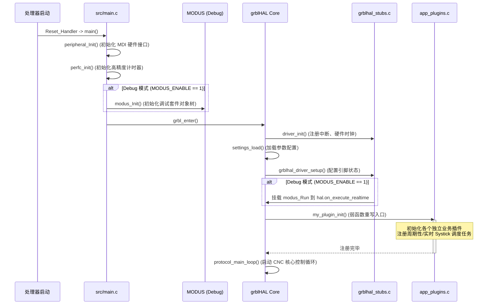

# 架构规格说明书：基于 grblHAL 中心的极简高实时 CNC 固件架构

本规格说明书详细阐述了固件项目重构为“以 grblHAL 为中心、高内聚低耦合、高可读与高实用性”的全新架构设计。该架构旨在确保 CNC 核心运动控制的绝对高实时性，同时保留 MODUS 优秀的开发调试套件，并支持优雅的、非侵入式的插件扩展。

---

## 1. 核心设计原则

1. **grblHAL 绝对主导**：主程序直接启动并移交控制权给 grblHAL。主循环完全由 grblHAL 接管，彻底消除多层框架嵌套带来的不确定性与实时性抖动。
2. **高内聚低耦合插件化 (`app_plugins.c`)**：任何非 grblHAL 原生支持的项目业务逻辑，一律编写为独立的插件，通过 `app_plugins.c` 中的 `my_plugin_init()` 进行集中挂载与任务注册，插件之间、插件与核心之间完全解耦。
3. **MDI 硬件接口统一性**：保持使用统一的设备接口（MODUS Device Interface），串口 DMA、GPIO 等硬件操作全部封装在 MDI 驱动层（如 `port_mdi.c`），无论是 grblHAL 核心流还是扩展插件，都通过 MDI 抽象层与硬件交互。
4. **双模裁切与零开销 Release**：
   - **Debug 模式**：通过 grblHAL 的空闲钩子驱动 `modus_Run()`，完美运行 `mshell`、`mwaveform` 和日志打印。
   - **Release 模式**：MODUS 核心代码完全不参与编译（0 字节运行时开销），以达到极致的代码体积与执行效率。

---

## 2. 启动与生命周期流程

系统启动的整体生命周期和调用链路如下图所示：



---

## 3. 详细代码与模块设计

### 3.1 极简的主入口设计 (`src/main.c`)
`main.c` 摒弃原来复杂的 MODUS 状态机，专注于系统引导与控制权移交：

```c
#include "global_define.h"
#include "peripheral.h"
#include "perf_counter.h"
#include "debug_transport.h"

#if MODUS_ENABLE
#include "modus.h"
static modus_t s_tModus = { .ptAppFlash = NULL };
#endif

int main(void)
{
    // 1. 初始化 MDI 硬件抽象层与微秒/毫秒级高精度计数器
    peripheral_Init();
    perfc_init(true);

#if MODUS_ENABLE
    // 2. 仅在 Debug 模式下使能 MODUS 调试套件
    #if MSHELL_ENABLE || !defined(__NO_USE_LOG__)
        debug_transport_init();
    #endif
    modus_Init(&s_tModus);
#endif

    // 3. 移交控制权：启动 grblHAL 主运动控制引擎（包含主循环，永不返回）
    extern int grbl_enter(void);
    grbl_enter();

    return 0;
}
```

### 3.2 滴答时钟与调试钩子管理 (`grblhal_adapt/grblhal_stubs.c`)
移除 `class/grblhal.c` 后，将 1ms 系统滴答与 MODUS 非阻塞钩子统一迁移到驱动适配层中实现：

```c
#include "grblhal_driver.h"

/* ---- grblHAL 系统 1ms 滴答时钟 ---- */
static volatile uint32_t s_wGrblhalTicks = 0;

uint32_t grblhal_get_ticks(void)
{
    return s_wGrblhalTicks;
}

void grblhal_ticks_inc(void)
{
    s_wGrblhalTicks++;
}

/* ---- MODUS 实时运行钩子 ---- */
#if MODUS_ENABLE
#include "modus.h"
static on_execute_realtime_ptr s_fnPrevExecuteRealtime = NULL;

static void debug_modus_realtime_hook(sys_state_t state)
{
    if (s_fnPrevExecuteRealtime) {
        s_fnPrevExecuteRealtime(state);
    }
    // 驱动调试控制台、波形采集等高优先级非阻塞任务
    modus_Run();
}
#endif

/* ---- 驱动与钩子挂载入口 ---- */
bool grblhal_driver_setup(settings_t *settings)
{
    // ... [硬件引脚映射、步进电机细分等配置] ...

#if MODUS_ENABLE
    // Debug 模式下：将 MODUS 轮询引擎无缝链式挂载到 grblHAL 实时空闲钩子
    s_fnPrevExecuteRealtime = grbl.on_execute_realtime;
    grbl.on_execute_realtime = debug_modus_realtime_hook;
#endif

    return true;
}
```

### 3.3 周期性滴答中断处理 (`target/at32f407/at32f407_it.c`)
系统硬件滴答中断（1ms）只保留最核心的调用，并在 Release 时自动去除 MODUS 调度开销：

```c
void SysTick_Handler(void)
{
    static uint32_t s_wLedTicks = 0;

    // perf_counter 溢出处理（各模块统一的非阻塞延时基础）
    perfc_port_insert_to_system_timer_insert_ovf_handler();

#if MODUS_ENABLE
    // 驱动 MODUS 内部时间片逻辑
    modus_Clock();
#endif

    // 累加 grblHAL 自身的 ticks 时间基准
    extern void grblhal_ticks_inc(void);
    grblhal_ticks_inc();

    // 串口接收 DMA 超时判断
    at32_usart_timer_1ms(&s_tUsart1Priv);

    // 状态指示灯闪烁（500ms）——使用统一的 MDI 接口控制外设
    if (++s_wLedTicks >= 500) {
        s_wLedTicks = 0;
        MDI_Toggle(HW.ptLedStatus);
    }
}

```

### 3.4 统一插件分发管理器 (`grblhal_adapt/app_plugins.c`)
高内聚低耦合的插件挂载入口。在插件初始化中推荐使用 `perf_counter` 的非阻塞 protothread（PT协程）进行业务开发，实现极其优雅、无抖动的周期性任务：

```c
/**
 * @file   app_plugins.c
 * @brief  Project Custom Plugins Dispatcher for grblHAL
 */

#include "grbl.h"
#include "hal.h"
#include "task.h"
#include "report.h"

// 1. 外部自定义业务插件声明
// extern void custom_safety_init(void);

/**
 * @brief 重写 grblHAL 核心的插件初始化钩子
 *        执行时机：外设初始化完成，主循环启动前
 */
void my_plugin_init(void)
{
    // 初始化自定义功能插件
    // custom_safety_init();
    
    // 报告插件信息，以便于在输入 $I 时显示
    // report_plugin("CUSTOM_SAFETY", "1.0");
}
```

#### 独立业务插件编写规范示例 (`custom_safety.c`)：
```c
#include "perf_counter.h"
#include "task.h"

static void custom_safety_poll(void *data)
{
    static uint8_t  s_chPtState = 0;
    static uint32_t s_wTimer = 0;

    // 使用 perf_counter 的免堆栈协程进行非阻塞延时与状态流转
    PERFC_PT_BEGIN(s_chPtState)

    while (1) {
        // 读取 MDI 引脚，或执行其他判断...
        
        // 优雅的非阻塞等待 100ms
        perfc_is_time_out_ms(100, &s_wTimer);
        PERFC_PT_WAIT_UNTIL(perfc_is_time_out_ms(100, &s_wTimer));
    }

    PERFC_PT_END()
}

void custom_safety_init(void)
{
    // 将该轮询逻辑注册到 grblHAL 后台低优先级任务管理器中
    task_add(custom_safety_poll, NULL, 5); // 每 5ms 轮询一次
}
```

---

## 4. 编译与裁剪配置 (`makefile`)

通过宏 `MODUS_ENABLE` 实现模块级条件编译，彻底隔离 Release 构建：

```makefile
MODUS_ENABLE ?= 1

ifeq ($(BUILD),release)
    OPT = -Os
    MODUS_ENABLE = 0
    MSHELL_ENABLE    = 0
    MWAVEFORM_ENABLE = 0
    MSTORAGE_ENABLE  = 0
    MBLINFO_ENABLE   = 0
    MODUS_USE_LOG    = 0
endif

# 条件编译和源文件树构建
ifeq ($(MODUS_ENABLE),1)
    include $(MODUS_ROOT)/modus.mk
    C_DEFS += -DMODUS_ENABLE=1
else
    C_DEFS += -DMODUS_ENABLE=0
    MODUS_INCLUDES = \
        -I$(MODUS_ROOT) \
        -I$(MODUS_ROOT)/src \
        -I$(MODUS_ROOT)/src/mdi \
        -I$(MODUS_ROOT)/src/arch \
        -I$(MODUS_ROOT)/src/arch/cortex-m \
        -I$(MODUS_ROOT)/src/arch/riscv \
        -I$(MODUS_ROOT)/lib/perf_counter \
        -I$(MODUS_ROOT)/lib/plooc
    MODUS_CFLAGS = -DMSHELL_ENABLE=0 -DMWAVEFORM_ENABLE=0
    
    # 仅编译必要的时间移植，完全不引入 modus 调度源文件
    MODUS_SRCS = $(MODUS_ROOT)/src/arch/perfc_port.c
    ifeq ($(TARGET_CHIP),ch592)
        MODUS_SRCS += $(MODUS_ROOT)/src/arch/riscv/riscv_shim.c
    endif
endif

# 组装最终源文件列表
C_SOURCES = \
    src/main.c \
    $(PERFC_PORT_C) \
    $(IT_C) \
    $(SYSTEM_C) \
    $(CHIP_SOURCES) \
    $(MODUS_SRCS) \
    $(PERIF_LIB_SOURCES) \
    $(PERIPHERAL_SOURCES) \
    $(FOC_SOURCES)

ifeq ($(MODUS_ENABLE),1)
    C_SOURCES += $(CLASS_SOURCES)
endif
```
