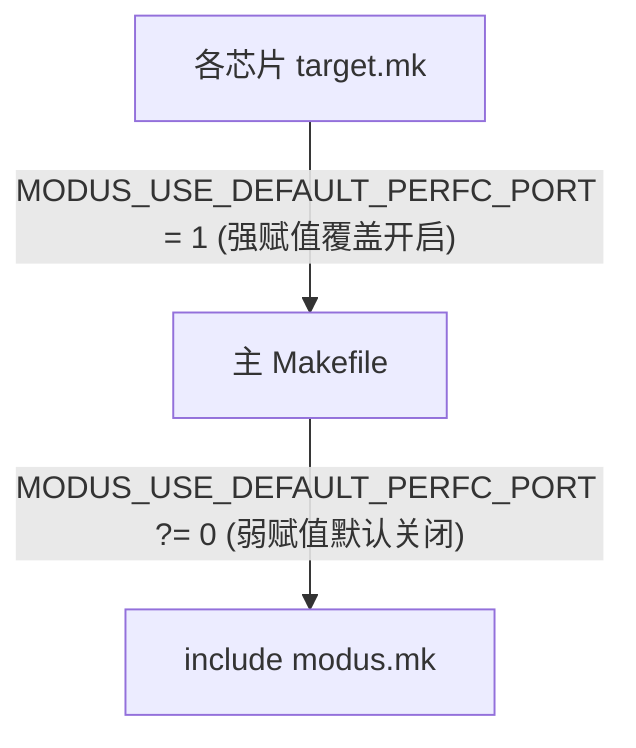

# MODUS 默认内置 perf_counter 移植配置优化设计方案 (Spec)

## 📌 背景与设计宗旨

在将 `modus` 子模块升级到 `v0.5.0.1` 的过程中，由于之前重构已将本仓库（`modus_template`）下所有的自定义 `perfc_port_user.c` 等文件删除，转而由 `modus` 核心库自带的双架构默认移植 `perfc_port.c` 接管。

因升级过程中在外部 `makefile` 里设置了强定义 `MODUS_USE_DEFAULT_PERFC_PORT = 0`，导致默认内置移植被排除在编译之外，产生了 `perfc_port_***` 符号未定义的链接错误。

为了在**不修改任何 `modus` 组件源文件**的前提下解决该编译问题，并兼顾未来在其他项目中对 `perfc` 移植的“自定义/默认”的灵活切换，我们采用主 `makefile` 级默认关闭、各芯片目标 `target.mk` 中按需显式开启的设计。

---

## 📂 方案设计

我们将主 Makefile 中对该配置的赋值改为弱赋值，而将具体的启用命令分发到各芯片的 `target.mk` 中：



---

## 📝 详细变更清单

### [Component 1: Modus Template 主编译配置 (e:\Project\modus_template)]

#### [MODIFY] [makefile](file:///e:/Project/modus_template/makefile)
* 将第 92 行的强赋值 `=` 修改为弱赋值 `?=`：
  ```diff
  -# 使用 template 提供的自定义移植，关闭 MODUS 默认内置移植
  -MODUS_USE_DEFAULT_PERFC_PORT = 0
  +# 默认关闭 MODUS 内置移植，各芯片 target.mk 可自行覆盖启用
  +MODUS_USE_DEFAULT_PERFC_PORT ?= 0
  ```

#### [MODIFY] [target/at32f413/target.mk](file:///e:/Project/modus_template/target/at32f413/target.mk)
* 在文件尾部追加配置以启用默认内置的 perf_counter 移植：
  ```makefile
  # 启用 MODUS 默认内置的 perf_counter 移植
  MODUS_USE_DEFAULT_PERFC_PORT = 1
  ```

#### [MODIFY] [target/at32f421/target.mk](file:///e:/Project/modus_template/target/at32f421/target.mk)
* 在文件尾部追加配置以启用默认内置的 perf_counter 移植：
  ```makefile
  # 启用 MODUS 默认内置的 perf_counter 移植
  MODUS_USE_DEFAULT_PERFC_PORT = 1
  ```

#### [MODIFY] [target/ch592/target.mk](file:///e:/Project/modus_template/target/ch592/target.mk)
* 在文件尾部追加配置以启用默认内置的 perf_counter 移植：
  ```makefile
  # 启用 MODUS 默认内置的 perf_counter 移植
  MODUS_USE_DEFAULT_PERFC_PORT = 1
  ```

#### [MODIFY] [target/stm32g431/target.mk](file:///e:/Project/modus_template/target/stm32g431/target.mk)
* 在文件尾部追加配置以启用默认内置的 perf_counter 移植：
  ```makefile
  # 启用 MODUS 默认内置的 perf_counter 移植
  MODUS_USE_DEFAULT_PERFC_PORT = 1
  ```

---

## 🧪 验证计划

1. **自动构建验证**：
   * 针对 `at32f421`：执行 `.\make.bat clean; .\make.bat`
   * 针对 `ch592`：执行 `.\make.bat clean; .\make.bat target=ch592`
   * 针对 `stm32g431`：执行 `.\make.bat clean; .\make.bat target=stm32g431`
   验证各平台链接步骤均能正常进行并生成固件，无符号重复或未定义错误。
